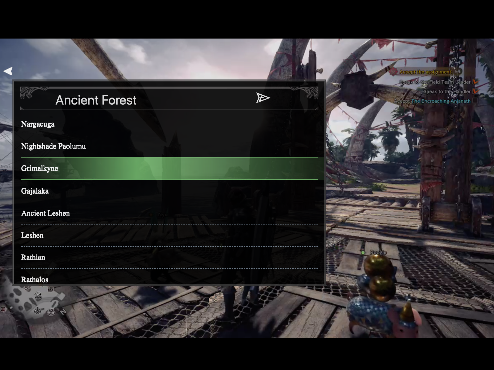
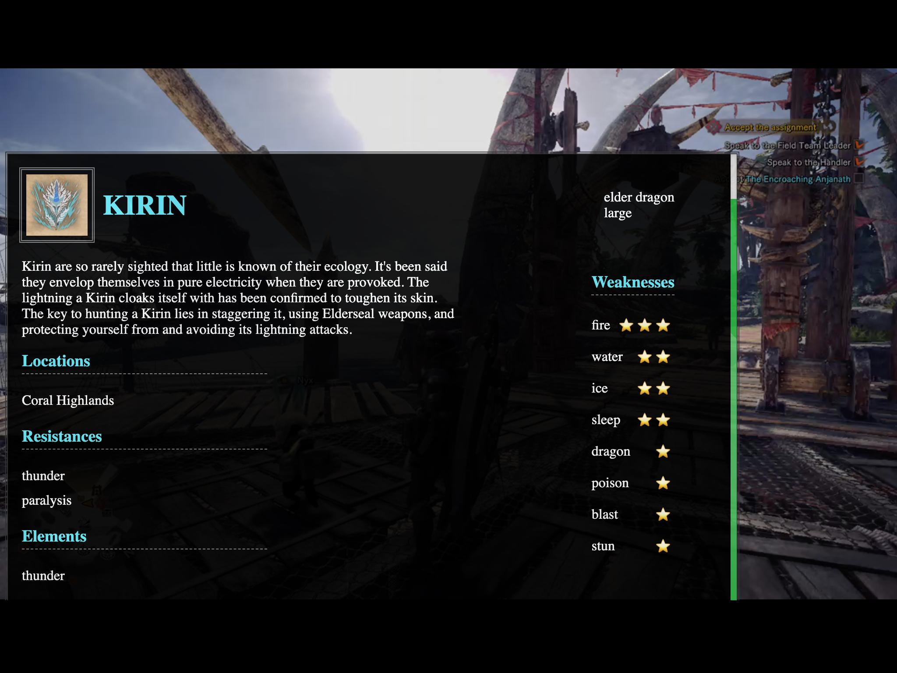

<h4 align="center">A game-matched Twitch extension for Monster Hunter: World and Iceborne.</h4>

<a href="#about">About</a> &mdash;
<a href="#project-status">Status</a> &mdash;
<a href="#installation">Install</a> &mdash;
<a href="#how-to-use">Usage</a> &mdash;
<a href="#authors">Authors</a> &mdash;
<a href="#support">Support</a> &mdash;
<a href="#license">License</a> &mdash;
<a href="#attributions--acknowledgements">Attributions</a>

---  

## About
Hunter's Handbook is all the power of a search engine for Monster Hunter: World (and Iceborne) right in your Twitch stream. Search by name or location to find the monster you're seeking. You'll find general info as well as strategic stats like weaknesses and resistances. 
<!-- need some examples here -->

## Project status
Pre-release  
Under active development as of 10/13/19  

## Installation  
### Installing the Hunter's Handbook extension on Twitch  
> NOTE: This extension is currently in the pre-release/testing phase. If you want to install it, you must be whitelisted and will receive a warning that it's in testing. The extension will be functional, but only whitelisted users can see and interact with it at this time. Once released officially, it will be available for use and interaction by all users.
Follow these instructions to install the Hunter's Handbook extension on your Twitch channel (upon release)  
1. Go to `https://www.twitch.tv/<YOUR_TWITCH_USERNAME>/dashboard/extensions` on Twitch
1. Search for "Hunter's Handbook"
1. Look for the latest version (currently, v0.0.1. You can find the version number in bottom right corner of the preview image)
1. Hover over the latest version for a dialog box that gives you 2 buttons (Details and Install)
1. Click "Install"
1. Head to `https://www.twitch.tv/<YOUR_TWITCH_USERNAME>/dashboard/extensions/manage` and Hunter's Handbook should now be under the "Installed" column
1. Click the "Activate" dropdown and select "Set as Overlay 1" in order to activate it on your channel
> NOTE: You can only have 1 (one) overlay extension enabled on your Twitch channel at any given time. If you decide to activate Hunter's Handbook, any other overlay extension will likely be disabled as a result.
8. That's all the config you need! Check out the [usage instructions](#how-to-use) if you need to know where to go from here!  

[Back to top](#doc-top)  

### Using the dev server  
Follow these instructions to run the Hunter's Handbook React app locally on your machine  
1. Clone this repo or fork it
1. Navigate to project directory in your terminal
1. Run `yarn install` or `npm install` in your terminal to install dependencies
1. Run `yarn start` or `npm run start` in your terminal to start the dev server

## How to Use  
(Haven't installed it yet? Check [here](#installation))  
### Instructions:  
1. Hover over the Twitch video player to bring up the Hunter's Handbook search icon  
    - It's the brown book with purple bookmark on the left side of the player (the one without the purple box around it)  
2. Click the Hunter's Handbook icon to bring up the search box  
3. Enter a search term (monster name or monster location) to bring up some results  
4. Click a result to bring up a "details" view for the selected monster  

### Usage Notes:  
- Use the white arrow in the top left to minimize Hunter's Handbook to the book icon state  
- If you mouse out of the Twitch player, Hunter's Handbook will fade into the background, quietly saving your place  
- Hunter's Handbook is "always on" on mobile (no hover or mouseover necessary to bring it up)
<!-- gif -->

## Authors
Kevon Eaglin - [@keagl1n](https://twitter.com/keagl1n "Kevon's Twitter")  
Matt Cool - [matthewbcool](https://github.com/matthewbcool "Matt's GitHub") 
<!-- pics and links -->

## Support 
You can reach out to us using the links above with any support needs, concerns, or even feedback. 
Or email us <a href="mailto:dev@keaglin.com, cooldevlabs@gmail.com?subject=Hunter's Handbook Support">here</a>!

## License
This project is licensed under AGPL 3.0. The gist is that you're free to modify it, distribute it, and even use it commercially, given certain conditions are met. See [LICENSE](https://github.com/keaglin/hunters-handbook/blob/master/LICENSE) for more detailed information.  
Additionally, you may need to get permission from the creators/owners of the images we've used here (under fair use) if you intend to sell your derivative work(s).

## Attributions & Acknowledgements
We are super grateful to have found so many good resources that allowed us to get up and running relatively quickly.  
- [MHWDB](https://github.com/LartTyler/MHWDB-API) monster list and the bulk of our data
- [IGN](https://www.ign.com/wikis/monster-hunter-world/Monster_List_-_Monster_Hunter:_World_and_Iceborne#Large_Monsters)'s monster list, icons and images
- [Fandom](https://monsterhunter.fandom.com/wiki/MHW:_Monsters)'s list, monster info, and icons
- [Create React App](https://github.com/facebook/create-react-app)
- [Rescripts](https://github.com/harrysolovay/rescripts) allowed us to rewire CRA to make a Twitch-compatible React app
- Twitch Dev's [Bot Commander](https://github.com/twitchdev/bot-commander)
- Handbook Icon: [Rafael Chiamenti](https://www.artstation.com/rafaelchm)
- [Monster Hunter World](https://www.monsterhunter.com/world-iceborne/us/ "Monster Hunter World Official Website") for border imagery

<a href="#doc-top">Top</a> &mdash;
<a href="#about">About</a> &mdash;
<a href="#project-status">Status</a> &mdash;
<a href="#installation">Install</a> &mdash;
<a href="#how-to-use">Usage</a> &mdash;
<a href="#authors">Authors</a> &mdash;
<a href="#support">Support</a> &mdash;
<a href="#license">License</a> &mdash;
<a href="#attributions--acknowledgements">Attributions</a>

## Contributors ✨

Thanks goes to these wonderful people ([emoji key](https://allcontributors.org/docs/en/emoji-key)):

<!-- ALL-CONTRIBUTORS-LIST:START - Do not remove or modify this section -->
<!-- prettier-ignore -->
<table>
  <tr>
    <td align="center"><a href="https://matthewbcool.github.io/portfolio/"> <b>Matt</b></a> <a href="https://github.com/keaglin/hunters-handbook/issues?q=author%3Amatthewbcool" title="Bug reports">🐛</a></td>
  </tr>
</table>

<!-- ALL-CONTRIBUTORS-LIST:END -->

This project follows the [all-contributors](https://github.com/all-contributors/all-contributors) specification. Contributions of any kind welcome!